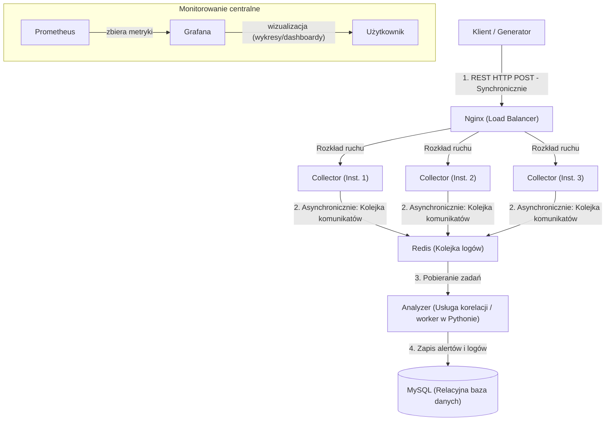

```mermaid
flowchart TD
    Client["Klient / Generator"] -->|"1. REST HTTP POST - Synchronicznie"| Nginx["Nginx (Load Balancer)"]
    
    Nginx -->|Rozkład ruchu| C1["Collector (Inst. 1)"]
    Nginx -->|Rozkład ruchu| C2["Collector (Inst. 2)"]
    Nginx -->|Rozkład ruchu| C3["Collector (Inst. 3)"]
    
    C1 & C2 & C3 -->|"2. Asynchronicznie: Kolejka komunikatów"| Redis["Redis (Kolejka logów)"]
    Redis -->|"3. Pobieranie zadań"| Analyzer["Analyzer (Usługa korelacji / worker w Pythonie)"]
    Analyzer -->|"4. Zapis alertów i logów"| MySQL[("MySQL (Relacyjna baza danych)")]

    subgraph Monitoring ["Monitorowanie centralne"]
        direction LR
        Prometheus["Prometheus"] -->|"zbiera metryki"| Grafana["Grafana"]
        Grafana -->|"wizualizacja (wykresy/dashboardy)"| User["Użytkownik"]
    end
```
